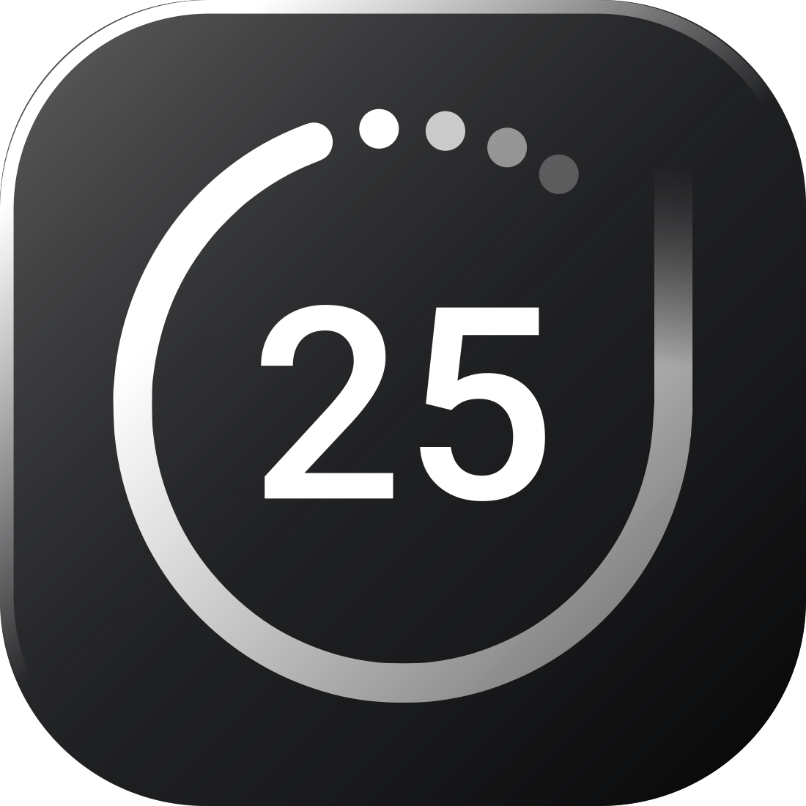

  

  <h1>FOCUS</h1>
  
  
A simple, beautiful, and minimalist focus timer app designed for students and professionals to improve productivity and manage study sessions effectively.

  
  

    
    
  

---

## ✨ Features

*   **Three Powerful Modes:**
    *   **Timer:** Set a specific duration for your tasks and stay on track.
    *   **Stopwatch:** Measure your work time without any limits.
    *   **Pomodoro:** Work in focused 25-minute sprints with short breaks to prevent burnout.
*   **Clean & Distraction-Free UI:** A minimal design that helps you concentrate on what's important.
*   **Multiple Color Themes:** Switch between Light, Dark, and OLED themes by double-clicking the background.
*   **Audio Cues:** Subtle sounds for timer completion and Pomodoro round changes.
*   **Keyboard Shortcuts:** Control the app without touching your mouse.
    *   `Spacebar`: Start / Pause
    *   `←` / `→`: Switch Modes
    *   `↑` / `↓`: Change Pomodoro Rounds (when paused)
*   **Lightweight & Efficient:** Built with Tauri, resulting in a very small app size and low memory usage (~160MB RAM).

---

## 🚀 Download & Installation

You can download the latest version of the Focus app for Windows from the link below:

### **[➡️ Download Latest Release](https://github.com/aninduuthsara/Focus---Pomodoro-Timer/releases/latest)**

1.  Go to the link above to open the Releases page.
2.  Download the `Focus_..._x64-setup.exe` file.
3.  Run the installer and follow the on-screen instructions.

---

## 🛠️ Built With

*   **Frontend:** Plain HTML, CSS, and JavaScript
*   **Desktop Framework:** [Tauri](https://tauri.app/) (using Rust)

---

## 👨‍💻 About the Developer

This project was created by **Anindu Uthsara**, a 17-year-old student from Sri Lanka, passionate about graphic design and programming.

*   **GitHub:** [@aninduuthsara](https://github.com/aninduuthsara)
*   **Email:** aninduuthsara.communexus@gmail.com

---

## ❤️ Support My Journey

If you find this app helpful, please consider supporting my journey. Your contribution helps me continue my education and create more useful tools.

---

  © 2025 Anindu Uthsara. All Rights Reserved.

